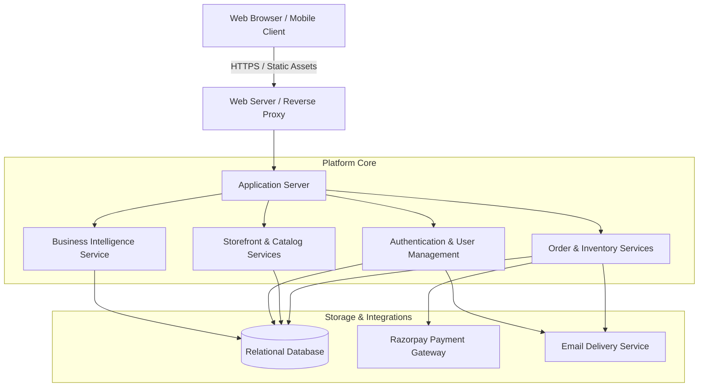
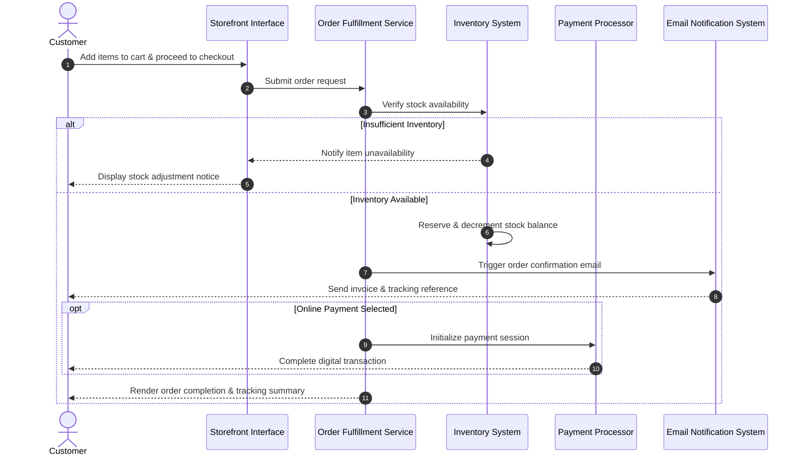

# Wholesale Snack Retail (WSR) - Enterprise E-Commerce Platform

[](https://www.djangoproject.com/)
[](https://www.python.org/)
[](https://www.sqlite.org/)
[](https://razorpay.com/)
[](https://getbootstrap.com/)

---

## Executive Summary

Wholesale Snack Retail (WSR) is an enterprise e-commerce platform designed for wholesale and direct-to-consumer snack distribution. The solution centralizes digital storefront operations, catalog browsing, secure multi-channel payments, real-time inventory management, order lifecycle tracking, and business intelligence reporting.

---

## Table of Contents

1. [Key Features](#key-features)
2. [High-Level Architecture](#high-level-architecture)
3. [Order Lifecycle Workflow](#order-lifecycle-workflow)
4. [Platform Modules](#platform-modules)
5. [Security and Compliance](#security-and-compliance)
6. [Installation and Setup](#installation-and-setup)
7. [Author](#author)

---

## Key Features

- **Dynamic Catalog and Search**: Multi-tier categorization, keyword-based search, and multi-parameter filtering across product categories and price ranges.
- **Real-Time Inventory Validation**: Automatic stock evaluation during checkout to prevent overselling of high-demand inventory.
- **Multi-Method Payments**: Support for Cash on Delivery (COD) as well as integrated digital payments via Razorpay.
- **Automated Communication**: Instant order confirmation and tracking dispatches via automated email notifications.
- **Self-Service Order Tracking**: Secure portal allowing customers to monitor delivery status and manage cancellation requests.
- **Customer Feedback Engine**: Integrated product review and rating system.
- **Executive Business Intelligence**: Operational dashboard displaying revenue metrics, sales volume, customer velocity, and fulfillment efficiency.
- **Centralized Administration**: Dedicated portal for catalog maintenance, order fulfillment updates, and inquiry tracking.

---

## High-Level Architecture

The platform follows a layered web architecture separating the user interface, business application services, external integrations, and persistent data storage.



---

## Order Lifecycle Workflow



---

## Platform Modules

### 1. Catalog and Merchandising
Organizes products through structured categories and subcategories. Accommodates pricing, unit availability, product descriptions, profit margins, and media assets. Customers can filter by category or price tier, as well as run global keyword searches.

### 2. User Accounts and Access Control
Manages user onboarding, authentication, and session handling. Features strict password validation standards and an out-of-band, 3-step OTP password recovery mechanism delivered via email.

### 3. Shopping Cart and Checkout
Provides a responsive client-side and server-validated shopping cart. During order submission, line items are validated against current inventory levels before orders are committed.

### 4. Payment Processing
Offers flexible settlement options tailored for both retail and wholesale customers:
- **Cash on Delivery (COD)**: Supports post-delivery settlements.
- **Razorpay Integration**: Supports debit cards, credit cards, UPI, and net banking with automated payment reconciliation.

### 5. Order Tracking and Customer Service
Enables customers to monitor shipments in real time using their Order ID. If an order needs to be revoked prior to fulfillment, a cancellation flow captures user justification for administrative review.

### 6. Business Intelligence Dashboard
A dedicated operational dashboard provides management with instant visibility into:
- Lifetime gross merchandise value and revenue.
- Total active customer registrations.
- Overall and monthly order velocity.
- Real-time fulfillment queue (active vs. cancelled orders).

---

## Security and Compliance

- **Password Policy Enforcement**: Mandatory password complexity requires a combination of uppercase, lowercase, numeric, and special characters with a minimum length threshold.
- **CSRF Mitigation**: Cross-Site Request Forgery protections are enforced across all form submissions and state-changing requests.
- **Session Protection**: Hardened session management ensures user data isolation across sessions.
- **Transactional Consistency**: Inventory reservations are verified prior to order placement to eliminate concurrency issues.

---

## Installation and Setup

### Prerequisites
- Python 3.10 or higher
- Git package manager

### 1. Clone the Repository
```bash
git clone https://github.com/HarshS-03/WSR.git
cd WSR
```

### 2. Set Up Virtual Environment

**Windows:**
```powershell
python -m venv venv
.\venv\Scripts\Activate.ps1
```

**macOS / Linux:**
```bash
python3 -m venv venv
source venv/bin/activate
```

### 3. Install Dependencies
```bash
pip install -r requirements.txt
```

### 4. Database Setup
Initialize the database and apply the schema migrations:
```bash
python manage.py migrate
```

### 5. Create Administrative Account
```bash
python manage.py createsuperuser
```

### 6. Run the Application
```bash
python manage.py runserver
```

Access the storefront at `http://127.0.0.1:8000/` and the administration console at `http://127.0.0.1:8000/admin/`.

---

## Author

- **Project Lead**: Harsh Shrimali ([GitHub Profile](https://github.com/HarshS-03))
